```{r setup, include=FALSE}
knitr::opts_chunk$set(echo = TRUE)
currentDict = list.files(path='images/',pattern='*.xlsm')
currentDict <- currentDict[length(currentDict)]
# This is necessary to ensure that the figures appear on the website.
if (! file.exists('.nojekyll')) file.create('.nojekyll')
if (! file.exists('docs/.nojekyll')) file.create('docs/.nojekyll')
```


# Workflow and Biostatistics

The `r currentDict` template contains a *DataDictionary* sheet and macros to create and format a corresponding *DataEntry* sheet to facilitate low-level data cleaning and data checking. 

The `exceldata` package contains functions for processing Excel files created with the DataDictionary template. 


```{r, eval=F, include=F}
library(DiagrammeR)
tmp <- grViz("digraph{

      graph[rankdir = TB]
      

      subgraph cluster_Excel {
         graph[fontname = Helvetica, fontcolor = white,
         shape = rectangle]
         style = rounded
         bgcolor = '#8da242'
    
         label = 'Researcher/Data Entry'
         
        subgraph cluster_dictionary {
        graph[fontcolor = black]
        bgcolor='#ccd5ab'
         label = 'Dictionary Sheet'
         node[fontname = Helvetica, fontcolor = darkslategray,style='filled',
         shape = rectangle, fillcolor = '#f2f4ea', margin = 0.25]
         J[label = 'Re-format Data Entry Sheet']
         I[label = 'Create Data Entry Sheet']
         H[label = 'User Defines Variables']
         }
         
        subgraph cluster_entry {
        graph[fontcolor = black]
        bgcolor='#ccd5ab'
        label = 'Data Entry Sheet'
         node[fontname = Helvetica, fontcolor = darkslategray,style='filled',
         shape = rectangle, fillcolor = '#f2f4ea', margin = 0.25]
         K[label = 'User Copies Existing Data']
         L[label = 'User Enters New Data']
         M[label = 'User Fixes Errors']
         N[label = 'Ready for Biostats']
        }
      

      }
  
      subgraph cluster_Biostats {
        label = 'Biostatistics'
        graph[fontname = Helvetica, fontcolor = white,
        shape = rectangle]
        style = rounded
        bgcolor = '#7da2a9'
        
        subgraph cluster_excelData {
        graph[fontcolor = black]
        bgcolor='#bed0d4'
        label ='excelData package'
        node[fontname = Helvetica, fontcolor = darkgray, style='filled',
        shape = rectangle, fillcolor = '#f0f4f5', margin = 0.25]
        A[label = 'Import Dictionary (readDataDict)']
        B[label = 'Import Data (readExcelData)']
        C[label = 'Perform Checks (checkData)']
        D[label = 'Create Factor Variables (addFactorVariables)']
        E[label = 'Create Calculated Variables (createCalculated)']
        F[label = 'Inspect Data (plotVariables)']
        }
  
        node[fontname = Helvetica, fontcolor = darkslategray,style='filled',
        shape = rectangle, fillcolor ='#f0f4f5', margin = 0.25]
        G[label = 'reportRx package']

      }
  
      edge[color = black, arrowhead = vee, arrowsize = 1.25]
      H -> I 
      I->L
      K->M
      L->M
      M->N
      K->J
      A -> B -> C ->D ->E ->F->G
      
      }",width="100%",height="100%")

# Save as image
tmp = DiagrammeRsvg::export_svg(tmp)
tmp = charToRaw(tmp) # flatten
rsvg::rsvg_png(tmp, "images/flow.png") # saved graph as png in current working directory

```


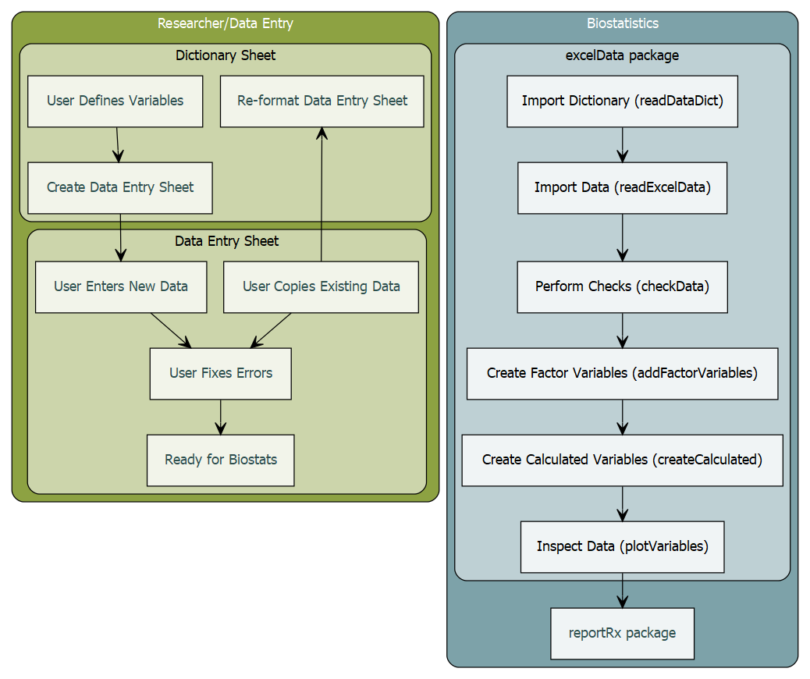


# The DataDictionary.xlsm file

The purpose of the DataDictionary is to facilitate high-quality data entry. This is achieved by pairing **dictionary** sheets, which contain information about the type of data with **data entry** sheets that store the actual data. 

Even if the data are already entered, the user can create a dictionary and a data entry table and then copy existing data into the table for error highlighting.


```{r, eval=F, include=F}
library(DiagrammeR)
tmp <- grViz("digraph{

      graph[rankdir = TB]
      

      subgraph cluster_Excel {
         graph[fontname = Helvetica, fontcolor = white,
         shape = rectangle]
         style = rounded
         bgcolor = '#8da242'
    
         label = 'Researcher/Data Entry'
         
        subgraph cluster_dictionary {
        graph[fontcolor = black]
        bgcolor='#ccd5ab'
         label = 'Dictionary Sheet'
         node[fontname = Helvetica, fontcolor = darkslategray,style='filled',
         shape = rectangle, fillcolor = '#f2f4ea', margin = 0.25]
         J[label = 'Re-format Data Entry Sheet']
         I[label = 'Create Data Entry Sheet']
         H[label = 'User Defines Variables']
         }
         
        subgraph cluster_entry {
        graph[fontcolor = black]
        bgcolor='#ccd5ab'
        label = 'Data Entry Sheet'
         node[fontname = Helvetica, fontcolor = darkslategray,style='filled',
         shape = rectangle, fillcolor = '#f2f4ea', margin = 0.25]
         K[label = 'User Copies Existing Data']
         L[label = 'User Enters New Data']
         M[label = 'User Fixes Errors']
         N[label = 'Ready for Biostats']
        }
      

      }
  

      edge[color = black, arrowhead = vee, arrowsize = 1.25]
      H -> I 
      I->L
      K->M
      L->M
      M->N
      K->J

      }",width="100%",height="100%")

# Save as image
tmp = DiagrammeRsvg::export_svg(tmp)
tmp = charToRaw(tmp) # flatten
rsvg::rsvg_png(tmp, "images/simpleexcel.png") # saved graph as png in current working directory

```


## Data Dictionary

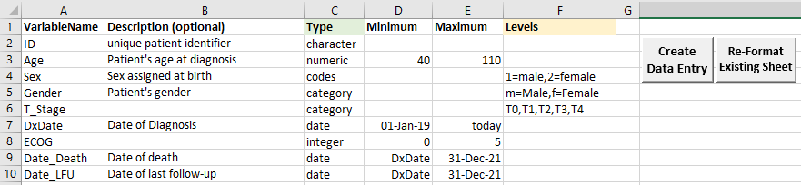

A user begins by specifying the name, type and allowed range (or values) for each variable. They then create a data entry sheet, by clicking the `Create Data Entry Sheet` button, which runs a macro to check that the dictionary is complete before generating a data entry sheet with data validation rules and conditional formatting.

## Variable Types

There are seven allowed types of variables: 

- *calculated* for variables where users specify calculations to be performed (age groups, overall survival)
- *category* for variables which can take only pre-specified values (male, female), or where **character** short forms are used (M=male, F=female)
- *character* for variables such as the id, or any variable not to be analysed
- *codes* for variables where **numeric** short forms are entered (ie 1=male, 2=female)
- *date* for all dates 
- *integer* for values which can take only whole numbers (ECOG score)
- *numeric* for all other numeric values


For the *date*, *integer* and *numeric* types the user must specify both a minimum and a maximum value. The minimum and maximum values can be numeric, the names of other variables in the data (if you want to make sure death is after diagnosis) or, for date types, 'today' can be used to allow all dates up to the time of entry.

For the *codes* and *category* variables the user needs to specify the allowed categories, or the codes, in the order they would like them presented. If they struggle with this for data that has already been entered, then the UNIQUE function in Excel may be of use to them, it will list all the unique variables in a range. 

Note that **codes** variables contain numeric data in the data entry sheet while **category** variables contain character data in the data entry sheet. 

Once the dictionary is complete clicking the the `Create Data Entry Sheet` button will create the data entry table. 

If the user wishes to change any of the ranges or codes after entering data then they can change the dictionary and click `Re-format Exising Sheet` to update the validation rules.

If code or category variables are present then a `_codes_` sheet will be created to contain the allowed values for data validation. This sheet contains the same name as the data entry sheet, suffixed by *_codes_*. This sheet is hidden from the user.

## Calculated Variables

Currently three types of calculated variables are supported: survival variables, recoded variables and categorised variables. 

When variables are re-coded or categorised a check is performed so that you can ensure the categories are created as expected and this is output to the log file.

### Survival Variables

Survival variables are calculated from three date variables: the starting date (date of diagnosis or randomisation), the event date (date of progression, or death) and the final date of follow-up. From these variables two variables will be created: the survival duration and the censor indicator.

**Syntax:** start=`startVar`,event=`eventVar`,last=`endVar`

where `startVar`, `eventVar` and `endVar` are variable names in the data corresponding to the start date, the event date and the date of last follow-up. 

Example survival calculation to use in the Data Dictionary: 

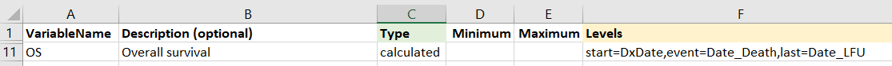

This will cause two variables to be created: `OS` (this is the name given in the VariableName column) and `OS_status` (the variable name with _status appended to it). The status marker will be 1 if the event occurred, in this case if there is a value in the `Date_Death` column and 0 otherwise. The OS variable will give the time from `DxDate` until `Date_Death`, or if no `Date_Death` was recorded then the time from `DxDate` to `Date_LFU.`

### Recoded Variables

Recoded variables are calculated from categorical or coded variables (as opposed to categorising a numerical variable)

**Syntax:** `OrginalVar`,newCode1=oldCode1,oldCode2,newCode2=oldCode3,oldCode4

where `OriginalVar` is the variable in the data to be recoded and newCodes=oldCodes gives the new category followed by comma-separated original categories.

Example of recoding a variable in the Data Dictionary: 

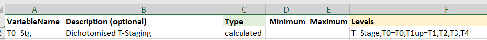

This will create the T0_Stg variable from T_Stage. T0_Stg will be T0 if T_Stage is T0 and T1up for all other values of T_Stage.

### Categorised Variables

Categorised variables are created from continuous variables

**Syntax:** `OrginalVar`,category1=<cutoff1,category2=<cutoff2,category3

where `OriginalVar` is the variable in the data to be categorised and category1,category2 etc are the names of the new categories (these will become factor levels) and cutoff1,cutoff2 are the cut-offs for each category and the final category (in this case category3) does not have a cutoff, only a name, because all people not meeting earlier criteria will be in this level. Note that at this point it is only possible to create categories by specifying the upper bounds.

Example of categorising a continuous variable in the Data Dictionary: 

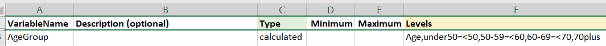
This will create the AgeGroup variable from Age with four levels: "under50','50-60','60-69','70plus'


### Combined Variables

Combined variables are used to detect patterns in sets of dichotomous variables. For example, if a survey has a number of yes/no or checklist questions about a single topic a combined variable can be created and used to determine the most common response patterns when the variables are plotted. Combined variables will be plotted a Pareto graph with up to the ten most common response patterns plotted.

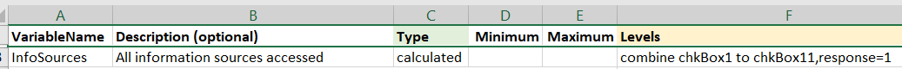
running `PlotVariables(data,vars='InfoSources')` will produce the following plot:

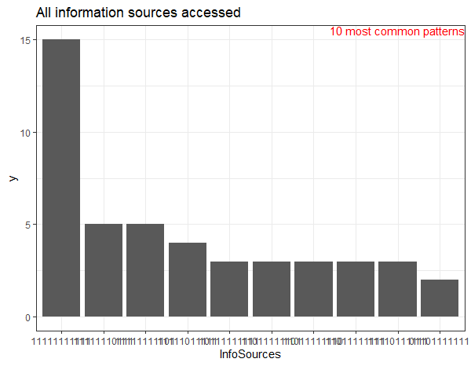


## Data Entry


The data entry table contains data validation rules (with prompts) and conditional formatting to highlight cells that fall outside the allowed range of the variable. 

Users can not enter data outside the allowed range, but they can copy it in from another source. If a user performs a regular paste (Ctrl+V) then the validation and formatting will be over-written. If this happens, then users should click the `Re-format Existing Sheet` button on the data dictionary sheet.  This will re-read all the values in the dictionary and re-apply formatting to the data entry sheet. This is also useful if the user changes the ranges of variables.

Once the data entry is complete, the user should click `Re-format Existing Sheet` to ensure all formats are up to date and all values are checked before sending to the Biostatistics department.


```{r, eval=F, include=F}
library(DiagrammeR)
tmp <- grViz("digraph{

      graph[rankdir = TB]
      

      subgraph cluster_Excel {
         graph[fontname = Helvetica, fontcolor = white,
         shape = rectangle]
         style = rounded
         bgcolor = '#8da242'
    
         label = 'Researcher/Data Entry'
         
        subgraph cluster_entry {
        graph[fontcolor = black]
        bgcolor='#ccd5ab'
        label = 'Data Entry Sheet'
         node[fontname = Helvetica, fontcolor = darkslategray,style='filled',
         shape = rectangle, fillcolor = '#f2f4ea', margin = 0.25]
         K[label = 'User Copies Existing Data']
         L[label = 'User Enters New Data']
         M[label = 'User Fixes Errors']
         N[label = 'Ready for Biostats']
        }
      
         
        subgraph cluster_codes {
        graph[fontcolor = black]
        bgcolor='#ccd5ab'
        label = 'Codes Sheet (hidden)'
         node[fontname = Helvetica, fontcolor = darkslategray,style='filled',
         shape = rectangle, fillcolor = '#f2f4ea', margin = 0.25]
         O[label = 'Codes for Data Validation']
         
        }
        subgraph cluster_dictionary {
        graph[fontcolor = black]
        bgcolor='#ccd5ab'
         label = 'Dictionary Sheet'
         node[fontname = Helvetica, fontcolor = darkslategray,style='filled',
         shape = rectangle, fillcolor = '#f2f4ea', margin = 0.25]
         J[label = 'Re-format Data Entry Sheet']
         I[label = 'Create Data Entry Sheet']
         H[label = 'User Defines Variables']
         }


      }
  
  
      edge[color = black, arrowhead = vee, arrowsize = 1.25]
      H -> I 
      I->L
      K->M
      L->M
      M->N
      K->J
      I -> O
      J ->O

      }",width="100%",height="100%")

# Save as image
tmp = DiagrammeRsvg::export_svg(tmp)
tmp = charToRaw(tmp) # flatten
rsvg::rsvg_png(tmp, "images/excel.png") # saved graph as png in current working directory

```

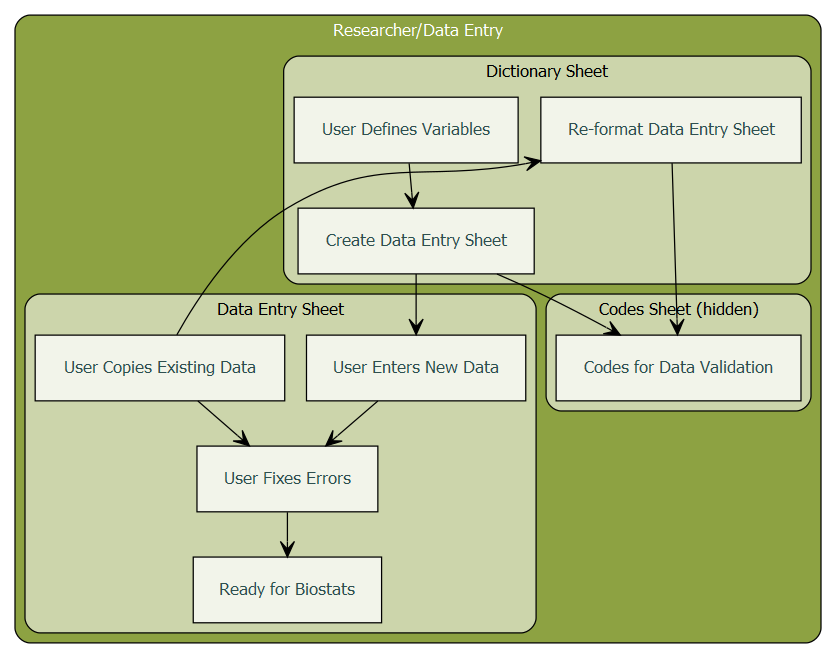

## Multiple Data Sheets

If the user wishes to have multiple data sheets (for static data vs assessment data) then multiple data dictionaries can be used. The user simply creates a copy of the DataDictionary sheet and creates a different data entry sheet. It will be obvious which dictionaries belong with which data entry sheets by looking at the variables.

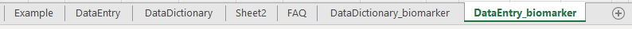

# The exceldata package {.tabset}

The exceldata package is a small companion to the DataDictionary workbook. The purpose is to read in the data dictionary and the data entry sheets and then to perform range checks on all the variables. The DataDictionary file does not *prevent* data entry errors, users can still copy and paste bad values into the sheet. 

```{r, eval=F, include=F}
library(DiagrammeR)
tmp <- grViz("digraph{

      graph[rankdir = TB]
      


  
      subgraph cluster_Biostats {
        label = 'Biostatistics'
        graph[fontname = Helvetica, fontcolor = white,
        shape = rectangle]
        style = rounded
        bgcolor = '#7da2a9'
        
        subgraph cluster_excelData {
        graph[fontcolor = black]
        bgcolor='#bed0d4'
        label ='importExcelData from excelData package'
        node[fontname = Helvetica, fontcolor = darkgray, style='filled',
        shape = rectangle, fillcolor = '#f0f4f5', margin = 0.25]
        A[label = 'Import Dictionary (readDataDict)']
        B[label = 'Import Data (readExcelData)']
        C[label = 'Perform Checks (checkData)']
        D[label = 'Create Factor Variables (addFactorVariables)']
        E[label = 'Create Calculated Variables (createCalculated)']
        
        }
  
        node[fontname = Helvetica, fontcolor = darkslategray,style='filled',
        shape = rectangle, fillcolor ='#f0f4f5', margin = 0.25]
        F[label = 'reportRx package']

      }
  
      edge[color = black, arrowhead = vee, arrowsize = 1.25]
      A -> B -> C ->D ->E -> F
      C -> B
      
      }",width="100%",height="100%")

# Save as image
tmp = DiagrammeRsvg::export_svg(tmp)
tmp = charToRaw(tmp) # flatten
rsvg::rsvg_png(tmp, "images/exceldatapkg.png") # saved graph as png in current working directory

```

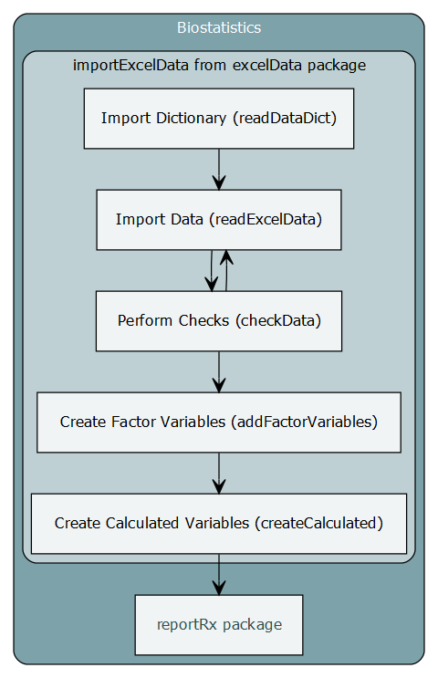

## importExcelData

The importExcelData function is a wrapper function that will create a log file, read in the data dictionary and the data, check the variable ranges, create factor variables and create any survival variables, recoded variables or categorised variables specified in the data dictionary. Steps and calculations are recorded in the log file, and checks are provided to make sure that variables are recoded and calculated properly.

**Syntax**

`import <- importExcelData(excelFile = 'C:/Users/lisa/OneDrive - UHN/reportRxTestData/testData.xlsm',
dictionarySheet='DataDictionary',dataSheet='DataEntry',saveWarnings=FALSE,setErrorsMissing=TRUE,timeUnit='month')`

The `timeUnit` argument applies only to calculated survival variables.

The data and data dictionary objects can then be extracted:

`data <- import$data`

`dict <- import$dictionary`

The log file will be created in the same directory as the data file.

## importExcelData Sub- Functions

### Import the Data Dictionary

The `readDataDict` function will import the dictionary file. This is slightly more useful than just using `readxl::read_excel` because checks will be performed to ensure the dictionary is complete and dates will be converted to easy to read text strings.

The file and sheet name must be specified. 

Optional Arguments:
 
- `colnames` Column names of the DataDictionary, defaults to those used in the Excel template
- `range` allows a specified range of the sheet to be imported (ie range = "A1:F10")
- `origin`  enables the origin of Excel dates to be set (defaults to 30 December 1899)
 
**!`readDataDict` must be run before `readExcelData`**

### Import the Data

The `readExcelData` function will import the data, using the specifications provided in the data dictionary. Again, this should be slightly more useful than a readxl::read_excel because:

- dates will be imported nicely
- variables not in the data dictionary will be removed
- there is an option to store any import warnings, which may be useful to send to the user
- the data can be read in 'strictly', setting all values that fall outside the allowed range to `NA` (This can be useful if users insist on using missing value codes)

The file and sheetname, as well as the object returned by the `readDataDict` function must be specified.

Optional Arguments:

- `range` allows a specified range of the sheet to be imported (ie range = "A1:AB102")
- `origin` enables the origin of Excel dates to be set (defaults to 30 December 1899)
- `saveWarnings` will return a list with the data frame and the import warnings (if there are any)
- `setErrorsMissing` will set all values out of range to `NA` **this should only be done if no warnings are given**


### Perform Checks

The `checkData` function will simply check the data against the data dictionary. This requires the outputs of `readDataDict` and `readExcelData`.

The `checkData` function will check for duplicate rows and check that all numeric, integer, date, code and category variables meet the requirements of the data dictionary. It does not check the data types, because these are enforced by the `readExcelData` function.

The outputs from `readDataDict` and `readExcelData` are required.

Optional Argument:

- id can be used to indicate the patient identifier (ie id ='SubjectID') which will provide errors for each id, instead of by row number

`checkData` returns a list with three elements:

- a data frame containing all the errors (rows and columns without errors are removed)

- a two-column data frame with Variable Names in one column and the location of errors in the second (either row numbers or IDs if provided)

- a two-column data frame with Row Numbers (or IDs) in one columns and the variable containing errors in the second column.


### Create Factor Variables

If keepOriginal = TRUE then `addFactorVariables` function will rename all the code and category variables suffixed with `_orig` (so *ecog* becomes *ecog_orig*) and create factor variables using the codes provided in the data dictionary as the factor levels and labels. Otherwise, if keepOriginal = FALSE then the existing variables are over-written with factor variables.

### Create Calculated Variables

The 'createCalculated' function calculated variables according the specifications given in the data dictionary. For recoded variables a contingency table is exported to the log file to ensure the categories have been created as expected. For categorised variables a table with the minimum and maximum values on the continuous variable is given for each category and also exported to the log file. For combined variables an attribute is tagged onto the variable so that it is printed as a Pareto graph by the `PlotVariables` function.


## PlotVariables

This is a simple function to produce barplots for factor and integer data and dotplots for continuous data, so that outliers can be easily identified and to see the distribution of the data. If the data are survey data then combined variables may be created to detect common response patterns. These are automatically displayed as a Pareto graph.

**Syntax**

First the data needs to be imported:

`import <- importExcelData(excelFile = 'C:/Users/lisa/OneDrive - UHN/reportRxTestData/testData.xlsm',saveWarnings = T)`

`data <- import$data`

Then the plots can be created:

`varPlots <- plotVariables(data)`

To view them in the plots view:

`print(varPlots)`

Each variable will be shown separately, the arrows at the top left of the Plots screen can be used to scroll through the plots

To show them all together on one page you can use the ggpubr package:

`ggpubr::ggarrange(plotlist=varPlots)`

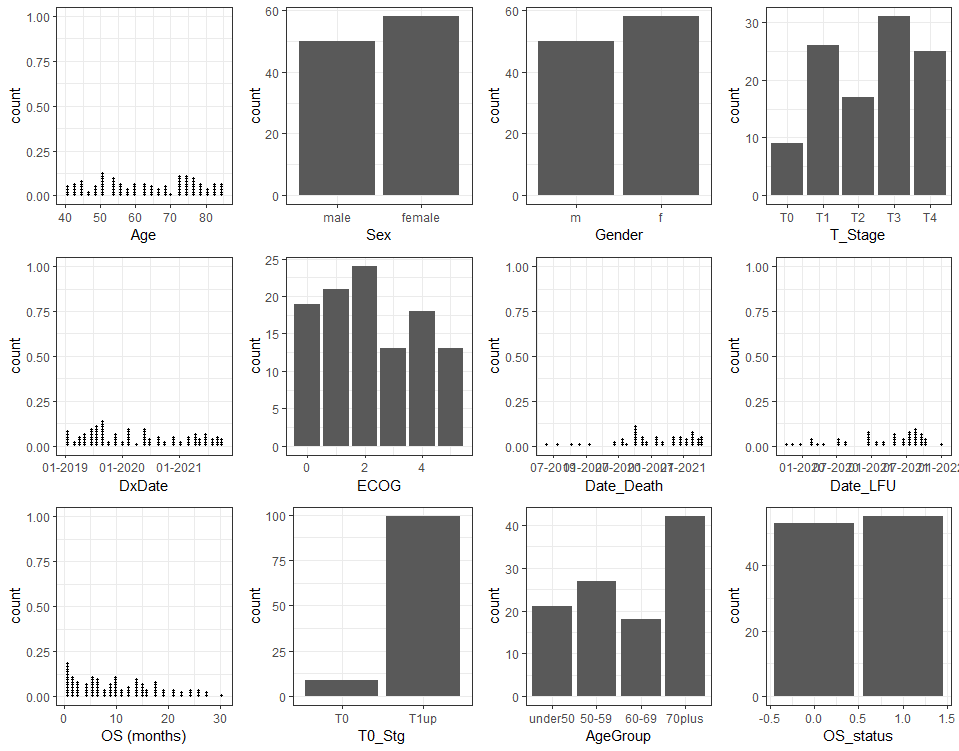
# Information for Users of the Data Dictionary

Good science requires good data! 

This is a guide to using the Excel macro-enabled template `DataDictionary.xlsm`

What isn't entered can't be analysed, but conversely, there is no need to provide multiple variables containing the same information (ie age *and* age categories).

**General Tips:**

- There can only be one header row
- One row per record, one column per piece of information
- Statistics programs can not read comments, decipher different colours  or other text formatting. Do not use these for information to be analysed, instead put the information is a separate column. 
- Statistics programs are case-sensitive and require accurate data entry: the values m, M, male, Male and MALE are all different categories to a computer.


## Data Dictionary 


### Variable names: 

- Must be unique
- Should be short and meaningful, descriptions can be put in the Description column
- Must begin with a letter
- Should not contain special characters or spaces, except for an underscore '_'.
- Long survey questions should be placed in the description. For the variable name use either a shortened version, or simply Q1, Q2, etc.

|Bad Variable Names  | Good Variable Names |
| :------------: | :-------------: |
|patient date in clinic  | clinic_date |
|pre-treatment ECOG  | ECOG_pre |
|Q1. What is your relationship to... | Q1_relationship |


### Types of Data

#### Identifiers

- No personally identifying data should appear, including EMR numbers
- Instead, keep a sheet separate to the data linking Study IDs to patient IDs 

#### Numeric Data

- Enter continuous data, such as Age or Weight as a single numeric field without any extra text (ie enter 50 instead of 50kg)
- Do not enter both Age and Age Category. Instead, enter age and specify AgeCat as a calculated variable
- Entering data once reduces the amount of data entry and the potential for errors.

#### Categorical Data

- Enter the Levels of categorical and code variables in the order you would like them presented (ie CR=complete recovery, PR=partial recovery,SD=stable disease,PD=progressive disease)
- Categorical data can be entered as numbers, letters or abbreviations instead of text 
- Categories are entered separate by commas
- Example:
  * T1,T2,T3,T4
- Codes are entered in the data dictionary in the format code=label separated by commas
- Examples:
  * 1=Female, 2=Male
  * CR= Complete Recovery, PR= Partial Recovery, SD = Stable Disease, PD = Progressive Disease

#### Dates

- Should be entered in an unambiguous format ie "01-Jan-2020"
- Should not begin with the Year (formatting and validation won't work properly)
- Dates can be copied in that begin with a year, but data checks need to be performed manually
- Dates after the current date will be highlighted in red as a warning


### Variable Ranges

- All date, integer and numeric values should have ranges specified. These should correspond to inclusion and exclusion criteria for your study, or natural values the variable can take. If you don't know the upper limit (ie of a biomarker), then put in the maximum reasonable value. Values above this will be flagged and you can adjust the maximum to include them if you wish.

The Minimum and Maximum can be:

- values (ie 40)
- variables names (if you want the minimum date of death to be DxDate for example)
- for date variables you can enter `today` to allow all dates up to the date of data entry

## Calculations

All calculations can be performed by the Biostatistics department. These will be done in code and are easily reproduced and re-calculated if there are changes to the data. This saves time and increases data quality.

Examples of some variables that can be easily calculated:

- Age (from Date of Birth and Assessment Date)
- Overall Survival (from Date of Diagnosis and Date of Death)
- Survival Status  (from Date of Death and Last Follow-up)
- Age or BMI categories from raw data

Do not do calculations in Excel. Instead, specify re-codings and calculations in the data dictionary.

Your can specify syntax to automatically create re-coded variables (these will not appear in your data entry sheet)

### Recoded Variables

Recoded variables are calculated from categorical or coded variables (as opposed to categorising a numerical variable)

**Syntax:** `OrginalVar`,newCode1=oldCode1,oldCode2,newCode2=oldCode3,oldCode4

where `OriginalVar` is the variable in the data to be recoded and newCodes=oldCodes gives the new category followed by comma-separated original categories.

Example of recoding a variable in the Data Dictionary: 


This will create the T0_Stg variable from T_Stage. T0_Stg will be T0 if T_Stage is T0 and T1up for all other values of T_Stage.

### Categorised Variables

Categorised variables are created from continuous variables

**Syntax:** `OrginalVar`,category1=<cutoff1,category2=<cutoff2,category3

where `OriginalVar` is the variable in the data to be categorised and category1,category2 etc are the names of the new categories (these will become factor levels) and cutoff1,cutoff2 are the cut-offs for each category and the final category (in this case category3) does not have a cutoff, only a name, because all people not meeting earlier criteria will be in this level. Note that at this point it is only possible to create categories by specifying the upper bounds.

Example of categorising a continuous variable in the Data Dictionary: 


This will create the AgeGroup variable from Age with four levels: "under50','50-60','60-69','70plus'


## Entering Data

Enter Data into the DataEntry sheet created by the DataDictionary

- Leave missing data blank
- Do not add additional header rows
- Cell formatting is removed by the Statistical Software, do not use it to convey information
- Cell comments can not be read in our Statistical Software, these should be for your own use only
- Hidden rows and columns are not hidden from our Statistical Software, remove these before sending
- Do not add pivot tables, summary statistics or graphs to the DataEntry sheet. You can create a copy of the DataEntry sheet to place these on.

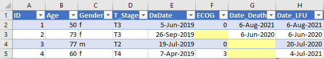


## Longitudinal Data

### Long Format
If data is repeatedly collected on patients, each observation or assessment can be in a separate row. This makes data checking and cleaning simpler, and reduces the size of your data dictionary because there are fewer variables.

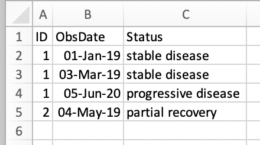

Static variables, like sex and age, or variables that were collected at a single time point can be entered in a separate sheet.

### Wide Format
If data are entered in wide format, with one row per patient then the variable names should be consistent across the time points, as shown below.

`r emo::ji("warning")` All variable names must be unique!

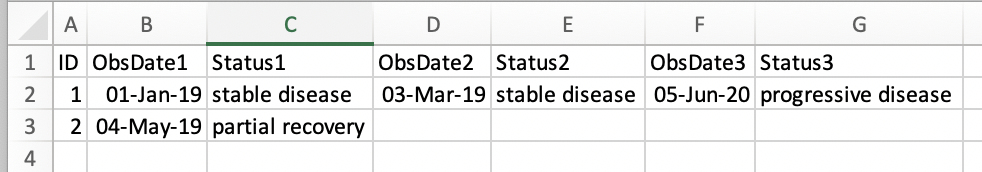

## Multiple Data Sheets

You can have as many data entry sheets as you need. This is a good idea for longitudinal studies where you may have one sheet with static patient information (age, sex, ethnicity) and another sheet for different assessments, especially if some patients are assessed more frequently than others and creating a column for each assessment is difficult.

Simple copy the DataDictionary sheet to create a new Data Dictionary 


## Revising Data

### Revising Ranges

If you need to change the maximum, minimum or allowed levels or codes for a variable simply make the changes in the DataDictionary sheet and click the `Re-format Existing Sheet` button. This will update the validation rules and conditional formatting to reflect the new ranges.

### Revising Data
If you notice an error, this should be corrected in your file and re-sent to us with the date in the filename. This ensures all the data is correct and up to date.

Do not change the layout of the data entry table.

### Adding a New Column
If you would like to add new columns to your data it is quite easy:

1. Add the variable(s) to the DataDictionary sheet
1. Enter a new name for the DataEntry sheet when prompted (maybe DataEntry2)
1. Copy the existing data from the original DataEntry sheet to your new sheet
1. On the DataDictionary sheet click **Re-Format Existing Sheet**
1. You can now enter data into your new sheet.


## Frequently Asked Questions

**My data is already in an Excel list from an online capture system, do I still need to enter the specifications?**

 Yes, but this should be a quick process. The reason that we need the specifications is to know how the data should look so that we can check for inconsistencies before analysing the data. Also, to know the appropriate ordering for the data. When the data is imported, a variable with levels such as 0-2 years, 3-5 years, 5-10 years and 10+ years can't be ordered correctly without a specification. You can use the UNIQUE function in Excel to extract all the unique values from a column (ie =UNIQUE(A2:A50) to get the unique values in column A up to row 50).


**I have a lot of variables and I don't want to enter specifications for all of them!**

It is essential to provide specification for all the variables you send to Biostatistics, but here are some tips to help: 
  1. Include only the variables you would like analysed in your DataDictionary. 
  1. If you still have a lot of variables, it is likely that a number of them will have the same type and range, so you can copy and paste those to save time. 
  1. If you have a lot of variables with spaces or special characters, place the original variable name in the description field, and give your variables simple names - these can be as simple as q1, q2, etc (you don't need to type those, Excel will allow you to highlight a few and then drag down automatically renaming to q3, q4 etc). 

