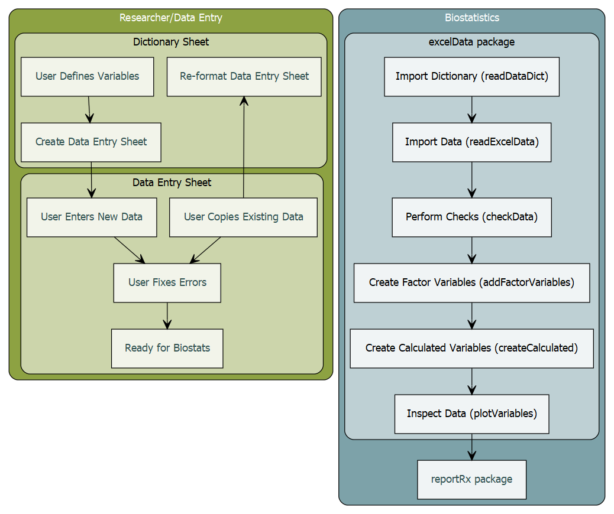
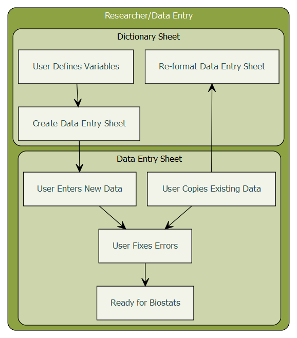
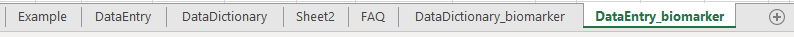
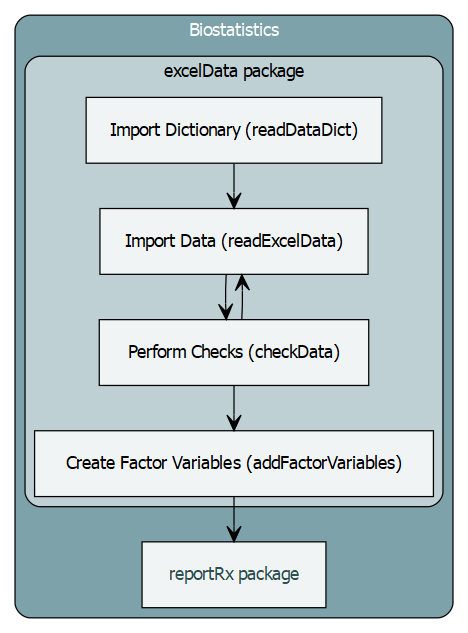

```{r, include = FALSE}
knitr::opts_chunk$set(
  collapse = TRUE,
  comment = "#>"
)
```

```{r setup, include=FALSE}
library(exceldata)
currentDict = 'DataDictionary0.3.xlsm'
```


# Introduction

The `exceldata` package contains functions for the processing of Excel files created with the `r currentDict` Excel file. These Excel files contain *Data Dictionary* sheets and corresponding *Data Entry* sheets that are read into R to facilitate low-level data cleaning and data checking. 


```{r, eval=F, include=F}
library(DiagrammeR)
tmp <- grViz("digraph{

      graph[rankdir = TB]
      

      subgraph cluster_Excel {
         graph[fontname = Helvetica, fontcolor = white,
         shape = rectangle]
         style = rounded
         bgcolor = '#8da242'
    
         label = 'Researcher/Data Entry'
         
        subgraph cluster_dictionary {
        graph[fontcolor = black]
        bgcolor='#ccd5ab'
         label = 'Dictionary Sheet'
         node[fontname = Helvetica, fontcolor = darkslategray,style='filled',
         shape = rectangle, fillcolor = '#f2f4ea', margin = 0.25]
         J[label = 'Re-format Data Entry Sheet']
         I[label = 'Create Data Entry Sheet']
         H[label = 'User Defines Variables']
         }
         
        subgraph cluster_entry {
        graph[fontcolor = black]
        bgcolor='#ccd5ab'
        label = 'Data Entry Sheet'
         node[fontname = Helvetica, fontcolor = darkslategray,style='filled',
         shape = rectangle, fillcolor = '#f2f4ea', margin = 0.25]
         K[label = 'User Copies Existing Data']
         L[label = 'User Enters New Data']
         M[label = 'User Fixes Errors']
         N[label = 'Ready for Biostats']
        }
      

      }
  
      subgraph cluster_Biostats {
        label = 'Biostatistics'
        graph[fontname = Helvetica, fontcolor = white,
        shape = rectangle]
        style = rounded
        bgcolor = '#7da2a9'
        
        subgraph cluster_excelData {
        graph[fontcolor = black]
        bgcolor='#bed0d4'
        label ='excelData package'
        node[fontname = Helvetica, fontcolor = darkgray, style='filled',
        shape = rectangle, fillcolor = '#f0f4f5', margin = 0.25]
        A[label = 'Import Dictionary (readDataDict)']
        B[label = 'Import Data (readExcelData)']
        C[label = 'Perform Checks (checkData)']
        D[label = 'Create Factor Variables (addFactorVariables)']
        
        }
  
        node[fontname = Helvetica, fontcolor = darkslategray,style='filled',
        shape = rectangle, fillcolor ='#f0f4f5', margin = 0.25]
        E[label = 'reportRx package']

      }
  
      edge[color = black, arrowhead = vee, arrowsize = 1.25]
      H -> I 
      I->L
      K->M
      L->M
      M->N
      K->J
      A -> B -> C ->D ->E
      
      }",width="100%",height="100%")

# Save as image
tmp = DiagrammeRsvg::export_svg(tmp)
tmp = charToRaw(tmp) # flatten
rsvg::rsvg_png(tmp, "vignettes/flow.png") # saved graph as png in current working directory

```





# The DataDictionary.xlsm file

The purpose of the DataDictionary is to facilitate high-quality data entry. This is achieved by pairing **dictionary** sheets, which contain information about the type of data with **data entry** sheets that store the actual data. Even if the data are already entered, the user can create a dictionary and a data entry table and copying the existing data into the table. Then will then be able to quickly identify any cells with incorrect values and cells with missing data.

## Data Dictionary


A user begins by specifying the name, type and allowed range (or values) for each variable. They then create a data entry sheet, by clicking the 'Create Data Entry Sheet' button, which runs a macro to check that the dictionary is complete before generating a data entry sheet with data validation rules and conditional formatting.

There are seven allowed types of variables: 

- *calculated* for variables where users specify calculations to be performed (age groups, overall survival)
- *category* for variables which can take only pre-specified values 
- *character* for variables such as the id, or any variable not to be analysed
- *codes* for variables where short forms are entered (ie 1=male, 2=female)
- *date* for all dates 
- *integer* for values which can take only whole numbers (ECOG score)
- *numeric* for all other numeric values


For the *date*, *integer* and *numeric* types the user must specify both a minimum and a maximum value. These can be adjusted during the data entry process (if for example there is a high but valid value for a biomarker). The minimum and maximum values can be numeric, the names of other variables in the data (if you want to make sure death is after diagnosis) or, for date types, 'today' can be used to allow all dates up to the time of entry.

For the *codes* and *category* variables the user needs to specify the allowed categories, or the codes, in the order they would like them presented. If they struggle with this for data that has already been entered, then the UNIQUE function in Excel may be of use to them, it will list all the unique variables in a range.

Once the dictionary is complete clicking the the 'Create Data Entry Sheet' button will create the data entry table. 

## Data Entry


The data entry table contains data validation rules (with prompts) and conditional formatting to highlight cells that fall outside the allowed range of the variable. Users can not entered data outside the allowed range, but they can copy it in from another source. If a user performs a regular paste (Ctrl+V) then the validation and formatting will be over-written. If this happens, then users should click the `Re-format Existing Sheet` button on the data dictionary sheet.  This will re-read all the values in the dictionary and re-apply formatting to the data entry sheet. This is also useful if the user changes the ranges of variables.

Once the data entry is complete, the user should click `Re-format Existing Sheet` to ensure all formats are up to date and all values are checked before sending to the Biostatistics department.


```{r, eval=F, include=F}
library(DiagrammeR)
tmp <- grViz("digraph{

      graph[rankdir = TB]
      

      subgraph cluster_Excel {
         graph[fontname = Helvetica, fontcolor = white,
         shape = rectangle]
         style = rounded
         bgcolor = '#8da242'
    
         label = 'Researcher/Data Entry'
         
        subgraph cluster_dictionary {
        graph[fontcolor = black]
        bgcolor='#ccd5ab'
         label = 'Dictionary Sheet'
         node[fontname = Helvetica, fontcolor = darkslategray,style='filled',
         shape = rectangle, fillcolor = '#f2f4ea', margin = 0.25]
         J[label = 'Re-format Data Entry Sheet']
         I[label = 'Create Data Entry Sheet']
         H[label = 'User Defines Variables']
         }
         
        subgraph cluster_entry {
        graph[fontcolor = black]
        bgcolor='#ccd5ab'
        label = 'Data Entry Sheet'
         node[fontname = Helvetica, fontcolor = darkslategray,style='filled',
         shape = rectangle, fillcolor = '#f2f4ea', margin = 0.25]
         K[label = 'User Copies Existing Data']
         L[label = 'User Enters New Data']
         M[label = 'User Fixes Errors']
         N[label = 'Ready for Biostats']
        }
      

      }
  
  
      edge[color = black, arrowhead = vee, arrowsize = 1.25]
      H -> I 
      I->L
      K->M
      L->M
      M->N
      K->J
      
      }",width="100%",height="100%")

# Save as image
tmp = DiagrammeRsvg::export_svg(tmp)
tmp = charToRaw(tmp) # flatten
rsvg::rsvg_png(tmp, "vignettes/excel.png") # saved graph as png in current working directory

```



## Multiple Data Sheets

If the user wishes to have multiple data sheets (for static data vs assessment data) then multiple data dictionaries can be used. The user simply creates a copy of the DataDictionary sheet and creates a different data entry sheet. It will be obvious which dictionaries belong with which data entry sheets by looking at the variables.



# The exceldata package {.tabset}

The exceldata package is a small companion to the DataDictionary workbook. The purpose is to read in the data dictionary and the data entry sheets and then to perform range checks on all the variables. The DataDictionary file does not prevent data files with errors, users can still copy and paste bad values into the sheet. 


## Import the Data Dictionary

The `readDataDict` function will import the dictionary file. This is slightly more useful than just using `readxl::read_excel` because checks will be performed to ensure the dictionary is complete and dates will be converted to easy to read text strings.

The file and sheetname must be specified. 

Optional Arguments:
 
- `colnames` Column names of the DataDictionary, defaults to those used in the Excel template c('VariableName', 'Description (optional)', 'Type', 'Minimum', 'Maximum', 'Levels')
- `range` allows a certain range of the sheet to be imported (ie range = "A1:F10")
- `origin` which enables the origin of Excel dates to be set (currently defaults to 30 December 1899)
 
**!This function needs to be run before `readExcelData`**

## Import the Data

The `readExcelData` function will import the data, using the specifications provided in the data dictionary. Again, this should be slightly more useful than a readxl::read_excel because:

- dates will be imported nicely
- variables not in the data dictionary will be removed
- there is an option to store any import warnings, which may be useful to send to the user
- the data can be read in 'strictly', setting all values that fall outside the allowed range to `NA` (This can be useful if users insist on using missing value codes)

The file and sheetname, as well as the object returned by the `readDataDict` function must be specified.

Optional Arguments:

- `range` allows a certain range of the sheet to be imported (ie range = "A1:F10")
- `origin` which enables the origin of Excel dates to be set (currently defaults to 30 December 1899)
- `saveWarnings` will return a list with the data frame and the import warnings (if there are any)
- `setErrorsMissing` will set all values out of range to NA **but this should only be done after running checkData!**


## Perform Checks

The `checkData` function will simply check the data against the data dictionary. This requires the outputs of `readDataDict` and `readExcelData`.

The `checkData` function will check for duplicate rows and check that all numeric, integer, date, code and category variables meet the requirements of the data dictionary. It does not check the data types, because these are enforced by the readExcelData function.

The outputs from readDataDict and readExcelData are required.

Optional Argument:

- id can be used to indicate the patient identifier (ie id ='SubjectID') which will provide errors for each id, instead of by row number

`checkData` returns

- a data frame containiny all the errors (rows and columns without errors are removed)

- a two-column data frame with Variable Names in one column and the location of errors in the second (either row numbers or IDs if provided)

- a two-column data frame with Row Numbers (or IDs) in one columns and the variable containing errors in the second column.


## Create Factor Variables

The `addFactorVariables` function will rename all the code and category variables suffixed with *_orig* (so *ecog* becomes *ecog_orig*) and create factor variables using the codes provided in the data dictionary as the factor levels and labels.

```{r, eval=F, include=F}
library(DiagrammeR)
tmp <- grViz("digraph{

      graph[rankdir = TB]
      


  
      subgraph cluster_Biostats {
        label = 'Biostatistics'
        graph[fontname = Helvetica, fontcolor = white,
        shape = rectangle]
        style = rounded
        bgcolor = '#7da2a9'
        
        subgraph cluster_excelData {
        graph[fontcolor = black]
        bgcolor='#bed0d4'
        label ='excelData package'
        node[fontname = Helvetica, fontcolor = darkgray, style='filled',
        shape = rectangle, fillcolor = '#f0f4f5', margin = 0.25]
        A[label = 'Import Dictionary (readDataDict)']
        B[label = 'Import Data (readExcelData)']
        C[label = 'Perform Checks (checkData)']
        D[label = 'Create Factor Variables (addFactorVariables)']
        
        }
  
        node[fontname = Helvetica, fontcolor = darkslategray,style='filled',
        shape = rectangle, fillcolor ='#f0f4f5', margin = 0.25]
        E[label = 'reportRx package']

      }
  
      edge[color = black, arrowhead = vee, arrowsize = 1.25]
      A -> B -> C ->D ->E
      C -> B
      
      }",width="100%",height="100%")

# Save as image
tmp = DiagrammeRsvg::export_svg(tmp)
tmp = charToRaw(tmp) # flatten
rsvg::rsvg_png(tmp, "vignettes/exceldatapkg.png") # saved graph as png in current working directory

```


