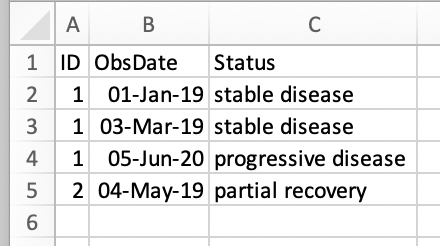
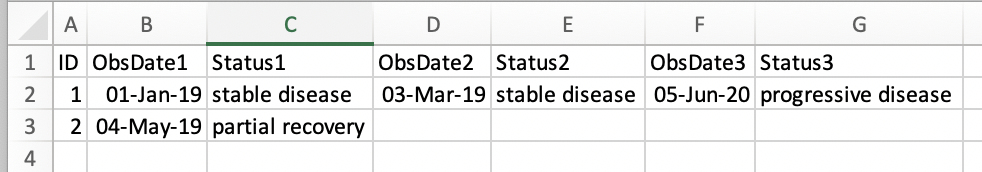

```{r, include = FALSE}
knitr::opts_chunk$set(
  collapse = TRUE,
  comment = "#>"
)
```


# Introduction

Good science requires good data! 

This is a guide to using the Excel macro-enabled template `DataDictionary.xlsm`

What isn't entered can't be analysed, but conversely, there is no need to provide multiple variables containing the same information (ie age and age categories).

The over-arching principles are simple:

- Enter data as completely and accurately as possible
- Don't enter data twice

# Data Dictionary

The data dictionary describes the data in your data file. 


## Variable names: 

- Should be short and meaningful, descriptions can be put in the data dictionary
- Must begin with a letter
- Should not contain special characters or spaces, except for an underscore '_'.
- Long survey questions should be placed in the description. Under the variable name, either a shortened version, or simply Q1, Q2, etc.


## Types of Data

### Numeric Data

- Enter continuous data, such as Age or Weight as a single numeric field
- Do not enter both Age and Age Category. Instead, enter age and specify AgeCat as a calculated variable
- Entering data once reduces the amount of data entry and the potential for errors.

### Categorical Data

- Enter the Levels of categorical and code variables in the order you would like them presented in (ie CR=complete recovery, PR=partial recovery,SD=stable disease,PD=progressive disease)
- Categorical data can be entered as numbers, letters or abbreviations instead of text 
- Categories are entered separate by spaces
- Example:
  * T1,T2,T3,T4
- Codes are entered in the data dictionary in the format code=label separated by spaces
- Examples:
  * 1=Female, 2=Male
  * CR= Complete Recovery, PR= Partial Recovery, SD = Stable Disease, PD = Progressive Disease

### Dates

- Should be entered in an unambiguous format ie "01-Jan-2020". 

This ensures that there is no confusion about the ordering of the month and the day and makes data checking and cleaning easier.


## Variable Ranges

- All date, integer and numeric values should have ranges specified. These should correspond to inclusion and exclusion criteria for your study, or natural values the variable can take. If you don't know the upper limit (ie of a biomarker), then put in the maximum reasonable value. Values above this will be flagged and you can adjust the maximum to include them if you wish.

The Minimum and Maximum can be:

- values (ie 40)
- variables names (if you want the minimum date of death to be DxDate for example)
- for date variables you can enter `today` to allow all dates up to the date of data entry

# Calculations

All calculations can be performed by the biostatistics department. These will be done in code and are easily reproduced and re-calculated if there are changes to the data. This saves time and increases data quality.

Examples of some variables that can be easily calculated:

- Age (from Date of Birth and Assessment Date)
- Overall Survival (from Date of Diagnosis and Date of Death)
- Survival Status  (from Date of Death and Last Follow-up)
- Age or BMI categories from raw data

Do not do calculations in Excel. Instead, specify re-codings and calculations in your statistical analysis plan and/or the data dictionary

# Revising Data

## Revising Ranges

If you need to change the maximum, minimum or allowed levels or codes for a variable simply make the changes in the DataDictionary sheet and click the `Re-format Existing Sheet` button. This will update the validation rules and conditional formatting to reflect the new ranges.


## Revising Data
If you notice an error, this should be corrected in your file and re-sent to us with the date in the filename. This ensures all the data is correct and up to date.

Please do not change the layout of the data entry table!

# Longitudinal Data
If data is repeatedly collected on patients, each observation or assessment should be in a separate row. This makes data checking and cleaning simpler, and reduces the size of your data dictionary because there are fewer variables.



Static variables, like sex and age, or variables that were collected at a single time point can be entered in a separate sheet.

# Wide Format
This format is discouraged, but if data are already entered in wide format, with one row per patient then the variable names should be consistent across the time points, as shown below.




# Frequently Asked Questions

**My data is already in an Excel list from an online capture system, do I still need to enter the specifications?**

 Yes, but this should be pretty quick. The reason that we need the specifications is to know the appropriate ordering for the data. When the data is imported, a variable with levels such as 0-2 years, 3-5 years, 5-10 years and 10+ years can't be ordered correctly without a specification. You can use the UNIQUE function in Excel to extract all the unique values from a column (ie =UNIQUE(A2:A50) to get the unique values in column A up to row 50).


**I have a lot of variables and I don't want to enter specifications for all of them!**

It is essential to provide specification for all your variables, but here are some tips to help: 
  1. Include only the variables you would like analysed in your DataDictionary. 
  1. If you still have a lot of variables, it is likely that a number of them will have the same type and range, so you can copy and paste those to save time. 
  1. If you have a lot of variables with spaces or special characters, place the original variable name in the description field, and give your variables simple names - these can be as simple as q1, q2, etc (you don't need to type those, Excel will allow you to highlight a few and then drag down automatically renaming to q3, q4 etc). 
